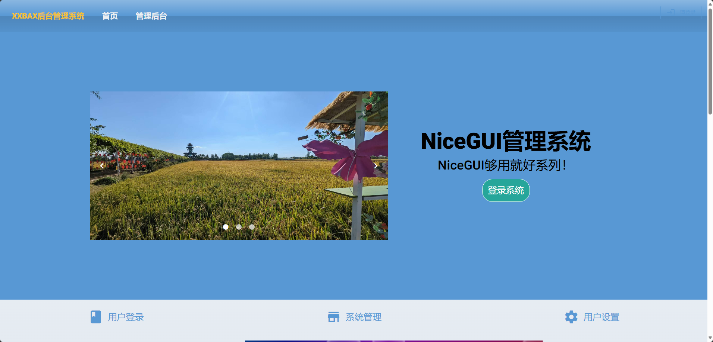
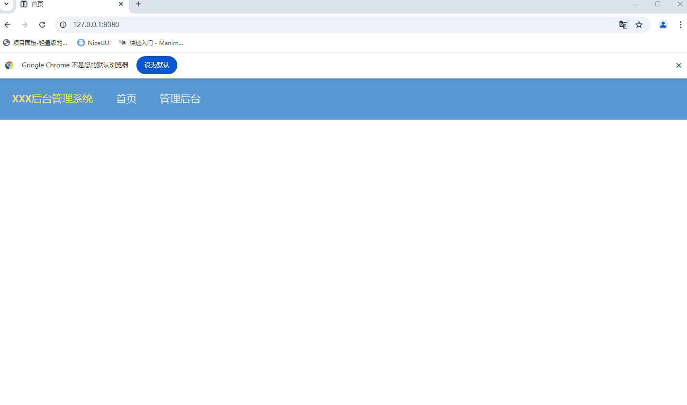
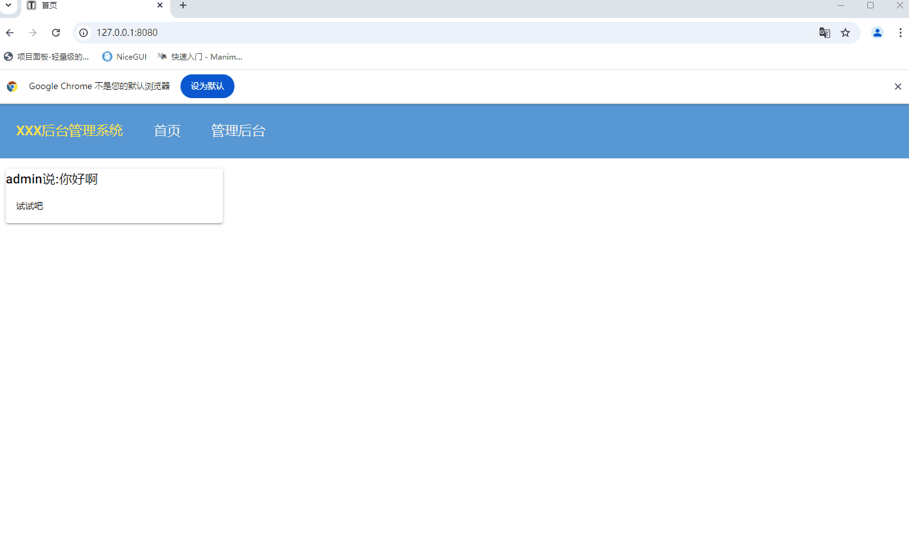
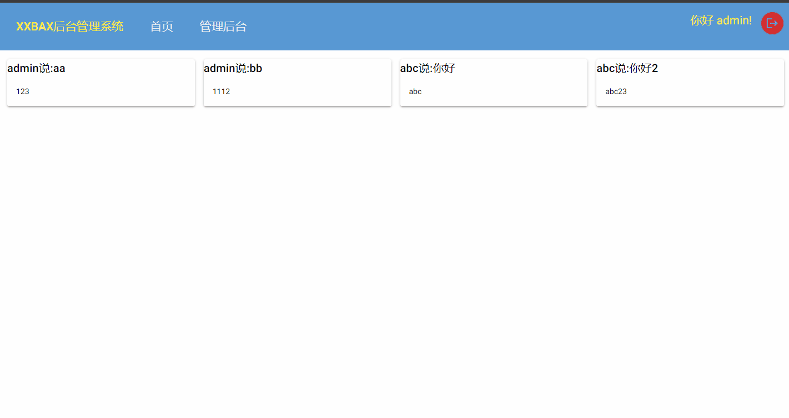
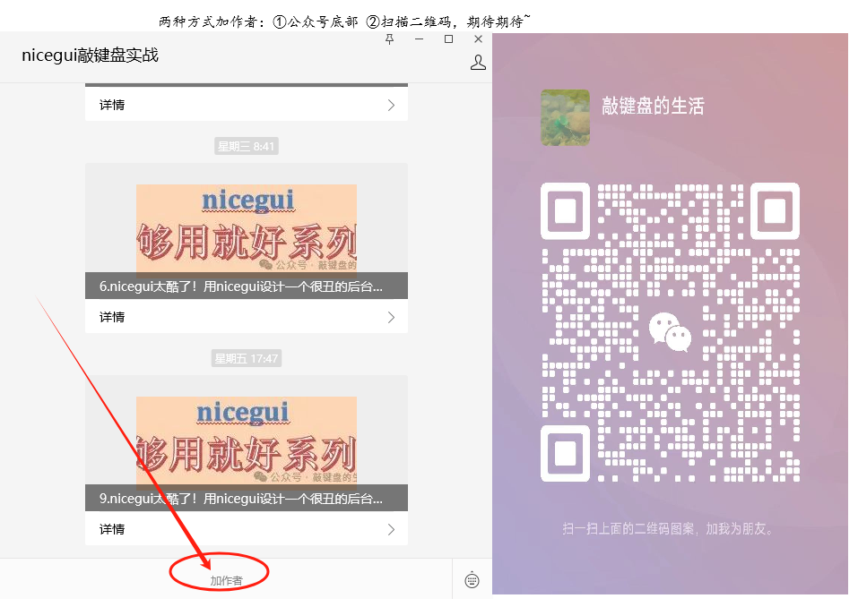

# nicegui-admin 基于NiceGUI开发的后台管理系统

NiceGUI这个框架实在是太可爱了，在你没有前端知识的时候也能做出个系统，在你有一些前端知识后又能做出很漂亮的系统，所谓进可攻、退可守也不过如此，非常适合不爱学前端的数据工作者。（为啥是数据工作者？因为有几个后端开发会选择python呢！）

本系统现在很“丑”，尚处于功能丰富阶段，不要对美学有期待，有意见和建议欢迎在公众号后台留言，也可以加群交流~
## 页面展示 
- 演示系统地址： 
地址:http://niceadmin.qiaojianpan.cn 
账号密码: admin/123456 

## 后台管理系统效果
1. 效果1
   
2. 效果2
   
3. 效果3
   

- NiceGUI系列博文请关注公众号“NiceGUI敲键盘实战”
  
- 建立了“NiceGUI交流群”，欢迎扫码入群，共同学习交流
  
- 也可以加作者共同学习
  
- [nicegui 够用就好系列文章”](https://mp.weixin.qq.com/mp/appmsgalbum?__biz=Mzg5NjQzNTg5OA==&action=getalbum&album_id=3621183102564827145#wechat_redirect)
